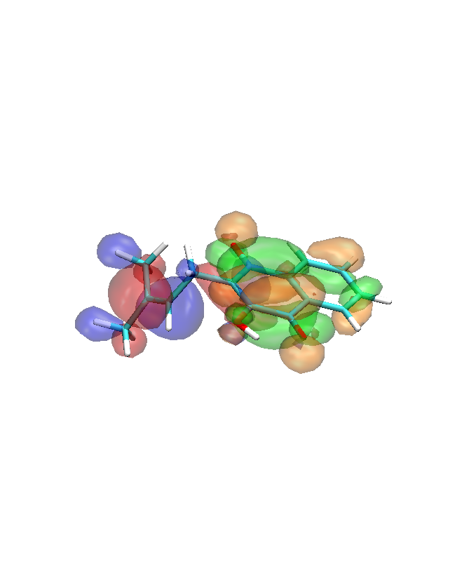
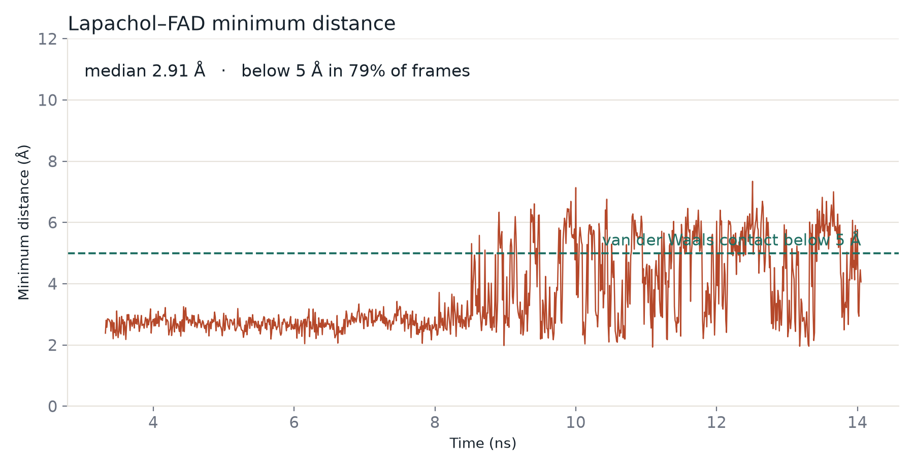
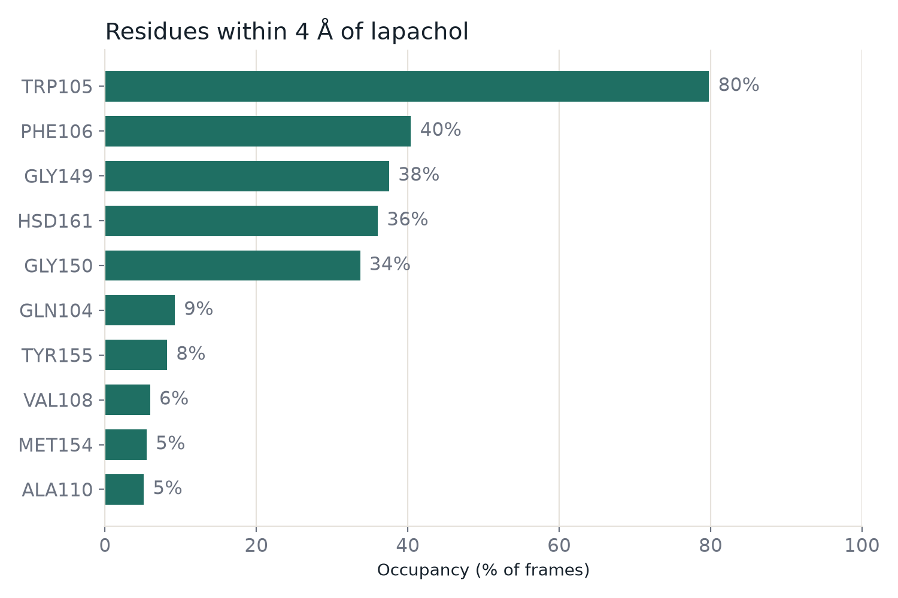
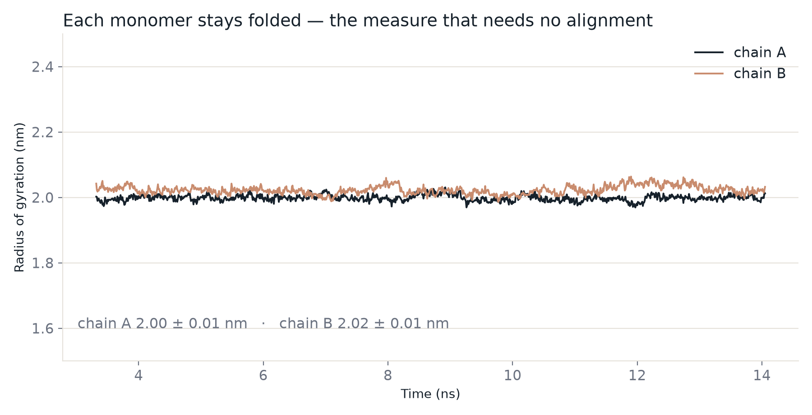

# Lapachol → NQO1: a reproducible DFT / docking / MD pipeline

An end-to-end computational study of **lapachol**, a naphthoquinone from the
Brazilian *ipê* tree (*Handroanthus* spp.), and its interaction with **human
NAD(P)H:quinone oxidoreductase 1 (NQO1)**. Electronic structure and docking were
run on a 4-core laptop with 8 GB of RAM; the molecular dynamics was run on a
single cloud GPU.

---

## 1. Scientific question

NQO1 catalyses the obligate two-electron reduction of quinones. For most
substrates this is a detoxification route, since the hydroquinone produced is
stable and readily conjugated. For a minority — notably β-lapachone, the cyclised
isomer of lapachol — the hydroquinone is unstable and re-oxidises spontaneously,
driving a futile redox cycle that depletes NAD(P)H and generates reactive oxygen
species. Because NQO1 is over-expressed in several solid tumours, this turns the
enzyme into a bioactivation switch rather than a protective one.

**Question addressed here:** can inexpensive, reproducible calculations
rationalise the redox behaviour of lapachol, and does the molecule occupy the
NQO1 catalytic site in a geometry compatible with hydride transfer from the FAD
cofactor?

| Stage | Method | Software | Output |
|-------|--------|----------|--------|
| 1 | Conformational search, geometry optimisation, frequencies, frontier orbitals, adiabatic electron affinity | CREST 3.0.2 / xTB, ORCA 6.1.0 | Electronic descriptors |
| 2 | Molecular docking into the NQO1 catalytic site, with protocol validation | AutoDock Vina 1.2.7 | Binding pose + validated protocol |
| 3 | Molecular dynamics of the solvated complex | GROMACS 2026.3 | Pose stability, contacts |

---

## 2. System

- **Ligand:** lapachol, C15H14O3, 18 heavy atoms, 32 atoms with hydrogens.
  Built from a **validated SMILES string**, not from a database name lookup —
  see [Section 7](#7-a-note-on-structure-provenance).
- **Receptor:** human NQO1, PDB **1D4A**, 1.7 Å resolution. Chains A and B were
  retained (the biological dimer), each with one FAD. The catalytic site forms at
  the dimer interface.
- **Reference ligand:** duroquinone from PDB **1DXO**, used as a redocking
  control.

---

## 3. Results

### 3.1 Electronic structure

Conformational search with CREST (GFN2-xTB, ALPB water) sampled 686 structures
and yielded **16 unique conformers**; the lowest-energy conformer accounts for
**40.1%** of the Boltzmann population at 298.15 K and was carried forward.

Geometry optimisation and analytical frequencies at B3LYP-D4/def2-SVP confirmed
a true minimum (no imaginary modes). Single-point energies at
B3LYP-D4/def2-TZVP with CPCM(water):

| Descriptor | Value |
|------------|-------|
| E(HOMO) | −6.382 eV |
| E(LUMO) | −3.255 eV |
| HOMO–LUMO gap | 3.127 eV |
| Chemical potential, μ | −4.819 eV |
| Chemical hardness, η | 1.564 eV |
| Electrophilicity index, ω | 7.425 eV |
| Adiabatic electron affinity | 3.770 eV |

The adiabatic electron affinity was obtained from separately optimised neutral
and radical-anion structures, avoiding reliance on Koopmans' theorem.



Frontier-orbital visualisation shows the **LUMO localised on the quinone ring**
with negligible density on the prenyl chain, while the HOMO occupies the opposite
end of the molecule. A deep LUMO, a narrow gap and a large electron affinity all
point the same way: lapachol is a vigorous electron acceptor in water.

### 3.2 Docking

The receptor was prepared from 1D4A with **FAD retained**, since the isoalloxazine
ring forms one wall of the substrate site. The search box was centred on the
duroquinone position transferred from 1DXO by superposition on the common
C-alpha atoms of chain A (**C-alpha RMSD 0.45 Å** — the two structures are
essentially identical). The chosen centre lies within contact distance of 31 FAD
atoms and of Trp105, Phe106, Tyr126, Tyr155 and the Thr147–Gly150 segment,
confirming it as the catalytic site.

**Protocol validation.** Duroquinone was redocked into the site from which it had
been removed. The top-ranked pose reproduced the crystallographic binding mode of
1DXO with an **RMSD of 1.11 Å**, well within the 2.0 Å acceptance criterion.

Lapachol docked with a top score of **−6.10** (Vina units; *not* a binding free
energy). The top eight poses fell within 0.6 units of each other with mutual
RMSDs of 1.3–2.6 Å, indicating convergence on a single binding region. In the
best pose the **quinone ring stacks directly on the FAD isoalloxazine ring** —
the geometry hydride transfer requires. No restraint imposed this arrangement.

### 3.3 Molecular dynamics

System built with CHARMM-GUI: CHARMM36m protein force field, CGenFF parameters
for ligand and cofactor, TIP3P water, 0.15 M KCl, rectangular box with 10 Å
padding, 270,039 atoms total. Energy minimisation converged (Fmax 934.6
kJ mol⁻¹ nm⁻¹); 125 ps of NVT equilibration reached 300.17 ± 13.57 K.
**10.7 ns** of unrestrained production was analysed (3.3–14.1 ns of the trajectory).

| Measurement | Result |
|-------------|--------|
| Backbone RMSD, chain A, second half | **2.48 ± 0.23 Å** |
| Radius of gyration, per monomer | **2.00 nm, constant across the trajectory** |
| Lapachol–FAD minimum distance, median | **2.91 Å** |
| Frames with lapachol–FAD distance < 5 Å | **848 of 1074 (79%)** |
| Trp105 contact occupancy | 78.3% |
| Phe106 contact occupancy | 40.1% |





A minimum distance of 2.91 Å is a van der Waals contact. **The stacking
interaction predicted by docking is retained under thermal motion and explicit
solvation.** Two independent measures agree closely: the ligand is within 5 Å of
FAD in 79% of frames, and in contact with Trp105 in 78%.

---

## 4. Interpretation

Three independent lines of evidence converge. The electronic descriptors place
lapachol among strong electrophiles, with a low-lying LUMO available to accept a
hydride. Orbital visualisation locates that accepting orbital on the quinone
ring, free of steric hindrance from the prenyl chain. And both docking and
dynamics place that same ring stacked against the flavin, in the coplanar
arrangement the transfer mechanism requires.

None of these establishes that lapachol *is* a substrate of NQO1 — that requires
measurement. What they establish is that its electronic structure and its
binding geometry are both compatible with the mechanism.

---

## 5. Limitations

- **Implicit solvation and single-conformer descriptors** are approximations. The
  conformer carried to DFT accounts for 40% of the Boltzmann population, which is
  dominant but not exclusive.
- **Koopmans' theorem** holds only approximately for Kohn–Sham orbitals. The
  descriptors here are relative, comparative quantities within one level of
  theory, not predicted experimental observables. The electron affinity is a
  total-energy difference and does not rely on it.
- **Vina scores rank poses**; they are not binding free energies and are not
  reported as such.
- **CGenFF parameter penalties:** FAD 1.500 (charge 0.632) — a good analogy;
  lapachol **28.500** (charge 10.767) — within the 10–50 range for which the
  developers recommend basic validation. This validation has not yet been
  performed and the affected torsional terms should be checked against a QM
  torsional scan before the parameters are reused.
- **A single 10.7 ns replica** tests pose stability. It does not converge binding
  thermodynamics, which would require enhanced sampling or alchemical methods.
- **The N-terminal Val1 of both chains** was unresolved beyond CB in 1D4A and was
  removed; the simulated construct spans residues 2–273. The residue is remote
  from the catalytic site.
- **Hydride transfer itself is not modelled.** That requires QM/MM, and is the
  natural continuation of this work.

---

## 6. A note on the global RMSD

The conventional protein and ligand RMSD traces are **not reported above**, and
the reason is worth stating rather than hiding.

The simulated system is a homodimer whose two chains became separated across the
periodic boundary during the run. Neither `-pbc mol -center` nor `-pbc cluster`
reassembled them, and because no single rigid-body superposition can
simultaneously overlay both chains, a global least-squares fit produced backbone
RMSD values above 30 Å — physically impossible for a folded protein.

Three observations established that this was an artefact of the measurement and
not of the simulation:

1. The **radius of gyration of each monomer** was 2.00 nm and constant to within
   0.01 nm over 10.7 ns. This quantity requires no alignment and no reference
   structure, so it is immune to the problem.
2. Restricting the fit to **chain A alone** gave a backbone RMSD of 2.48 ± 0.23 Å
   — a normal, stable value.


3. The **lapachol–FAD minimum distance**, computed under the minimum-image
   convention, remained at van der Waals contact throughout.

The binding analysis therefore uses interatomic distances and contact
occupancies, which are well defined under periodic boundary conditions, rather
than a global RMSD, which is not.

---

## 7. A note on structure provenance

The lapachol structure was **not** taken from a database name search. Retrieving
"lapachol" by name returned a compound with the correct molecular formula
(C15H14O3), hydroxyl and prenyl groups, but with the two carbonyls **adjacent** —
an *ortho*-quinone rather than the 1,4-*para*-quinone required.

The structure used was built from a validated SMILES string,

```
CC(C)=CCC1=C(O)C(=O)c2ccccc2C1=O
```

and verified by round-tripping back to SMILES after 3D generation. Lapachol and
β-lapachone are isomers sharing a molecular formula, so formula agreement alone
is not sufficient verification.

---

## 8. Reproducing this work

```bash
git clone https://github.com/aprendemed50-creator/lapachol-nqo1.git
cd lapachol-nqo1
conda env create -f environment.yml
conda activate lapachol
```

```bash
bash 01_dft/run_orca.sh            # ~4 h on 4 cores
bash 02_docking/run_docking.sh     # ~5 min
# 03_md: system built with CHARMM-GUI; production run on a cloud GPU
python 04_analysis/orca_descriptors.py
```

**Software versions**, which CGenFF and ORCA both require to be cited for
reproducibility:

| Component | Version |
|-----------|---------|
| ORCA | 6.1.0 |
| OpenMPI | 4.1.8 |
| CREST | 3.0.2 (GFN2-xTB) |
| AutoDock Vina | 1.2.7 |
| GROMACS | 2026.3 (CUDA) |
| CGenFF | program 4.0, force field 5.0 |
| Force field | CHARMM36m / CGenFF, TIP3P |

---

## 9. References

See [`docs/REFERENCES.md`](docs/REFERENCES.md).

## 10. Licence

MIT — see [`LICENSE`](LICENSE).
